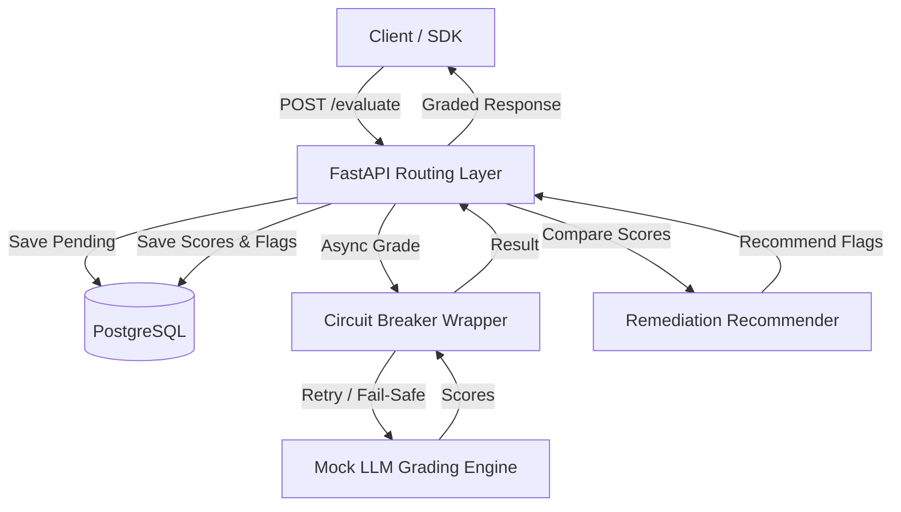

# Task 1 — Samvaad Saathi Design Document

## Architectural Highlights

Samvaad Saathi is a high-performance evaluation engine designed for asynchronous audio transcripts and pacing assessments.

### Components

1. **FastAPI Core & Router Layer**
   - High-throughput asynchronous controllers that handle JSON validation using Pydantic V2 models.
   - Non-blocking execution paths that leverage Python `asyncio` for high concurrent requests capacity.
2. **Database Layer (SQLAlchemy 2.0 Async)**
   - Utilizes `asyncpg` drivers and async sessions.
   - Relies on event hooks (`lifespan`) to auto-create schemas on startup.
   - Normalised tables with cascading constraints (`submissions` -> `scores` and `remediation_flags`).
3. **AI Grading Service Simulator**
   - Simulates actual AI API latency (2s delays) using `asyncio.sleep()`.
   - Replicates remote execution flaws (timeouts/connection drops) via controlled 10% error probabilities.
4. **Resilient Circuit Breaker**
   - Wraps LLM grading calls in a stateful retry mechanism.
   - Retries failed invocations up to 2 times with a 1-second delay.
   - Automatically returns a graceful fallback status (`status: pending`) instead of returning 5xx failures if all attempts exhaust.
5. **Remediation Recommender**
   - Compares pacing, knowledge, and filler word usage scores against dynamic thresholds passed in the request body.
   - Triggers course targets such as "Structure Practice" or "Pacing Practice".
