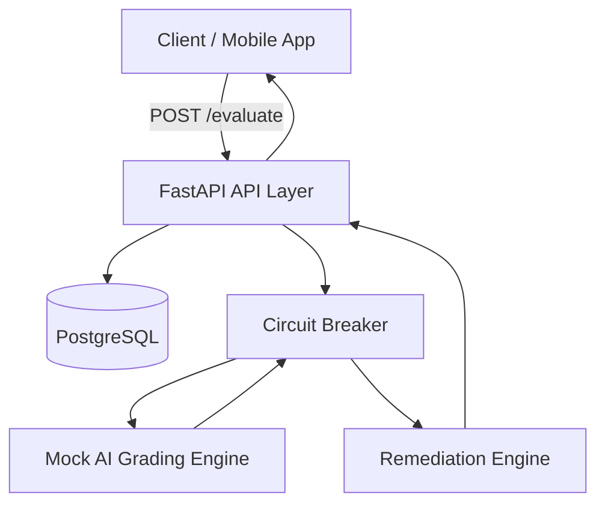
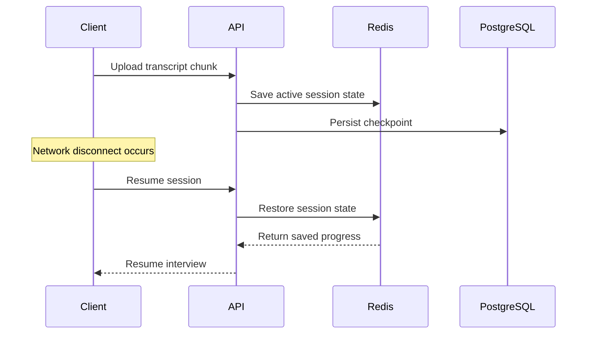
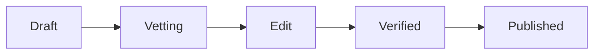
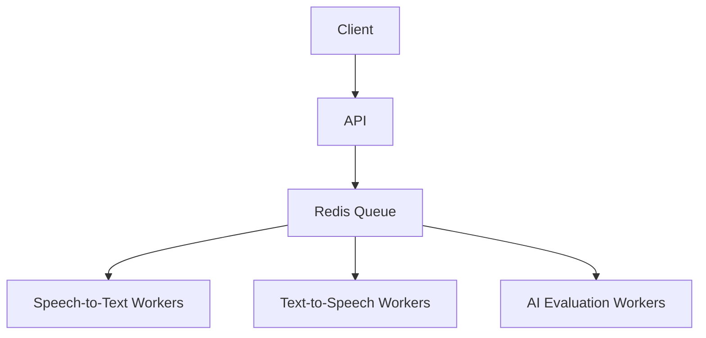

# Task 1 — Samvaad Saathi Design Document

# Overview

Samvaad Saathi is an asynchronous AI-powered interview evaluation system designed for scalability, resiliency, and low-bandwidth environments.

The system processes interview transcripts, simulates AI grading, applies remediation logic, and stores evaluation results while remaining fault tolerant under unreliable network or AI conditions.

---

# High Level Architecture



---

# 1. The Orchestration Layer — Conversation State & Resilience

## Problem

Students from underserved communities may experience:

- unstable internet
- packet loss
- interrupted uploads
- temporary disconnections

The system must allow interviews to resume safely without losing state.

---

# State Management Strategy

A hybrid state management approach is used.

| Layer | Purpose |
|---|---|
| Client-side | Temporary buffering |
| Redis Cache | Active session recovery |
| PostgreSQL | Durable persistence |

---

# Why Hybrid State Management?

## Client Side

The client temporarily buffers:

- transcript chunks
- audio metadata
- current interview progress

This reduces repeated uploads during temporary network interruptions.

---

## Redis Session Layer

Redis stores:

- current active question
- partial transcript
- pacing metrics
- current interview stage

Benefits:

- fast session recovery
- low-latency access
- short-term persistence

TTL-based expiration automatically cleans abandoned sessions.

---

## PostgreSQL Persistence

PostgreSQL stores:

- final transcript
- scores
- remediation flags
- interview history

Benefits:

- durability
- analytics support
- auditability

---

# Drop-off Recovery Flow



---

# 2. Admin Dashboard Logic — Versioning & Decoupling

## Problem

Non-technical program teams should:

- create new interview roles
- edit role questions
- verify content
- publish safely

without affecting active interviews.

---

# Role Versioning Strategy

Each role uses immutable version records.

Example:

| Role | Version | Status |
|---|---|---|
| Customer Success | v1 | Published |
| Customer Success | v2 | Draft |
| Customer Success | v3 | Verified |

Students already in interviews remain pinned to the version they started with.

---

# Safe Publishing

When an admin publishes a new role version:

- new interviews use the latest published version
- existing interviews continue using their original version

This avoids mid-interview inconsistencies.

---

# Verification Workflow



---

# Database Schema Concept

## interview_roles

| Column | Purpose |
|---|---|
| role_id | Logical role |
| version | Immutable version |
| status | draft / verified / published |
| config_json | Questions + thresholds |

---

# 3. Optimized Resource Management — Scaling Voice & AI

## Expected Load

Placement drives may generate:

- 5,000+ concurrent students
- bursty traffic
- high STT/TTS usage

---

# Queuing Strategy



---

# Benefits

## Redis Queue

Provides:

- load smoothing
- backpressure handling
- retry management
- burst absorption

---

# Caching Strategy

Frequently reused assets are cached:

- interviewer prompts
- generated TTS audio
- role configurations

Using:

- Redis
- CDN edge caching

---

# Latency Optimization

## Streaming Transcripts

Instead of waiting for complete uploads:

- audio chunks stream incrementally
- STT processing starts early

This reduces perceived latency.

---

## Adaptive Compression

For low-bandwidth users:

- compressed audio codecs
- reduced bitrate streaming
- partial transcript uploads

are used.

---

# Fault Tolerance Strategy

## Circuit Breaker

The AI grading layer uses:

- retry logic
- timeout handling
- graceful fallback responses

If grading fails:

```json
{
  "status": "pending"
}
```

is returned instead of a server crash.

---

# Scalability Approach

The system scales horizontally by:

- adding FastAPI replicas
- adding Redis workers
- separating AI processing workers
- decoupling persistence layer

---

# Tradeoffs

| Decision | Benefit | Tradeoff |
|---|---|---|
| Redis session cache | Fast recovery | Extra infra |
| Async APIs | High concurrency | More complexity |
| Queue-based AI | Scalability | Slight processing delay |
| Hybrid persistence | Reliability | Synchronization overhead |

---

# Final Notes

The architecture prioritizes:

- resilience
- low-bandwidth optimization
- async scalability
- fault tolerance
- modular extensibility

while remaining cost-effective for large-scale educational deployments.