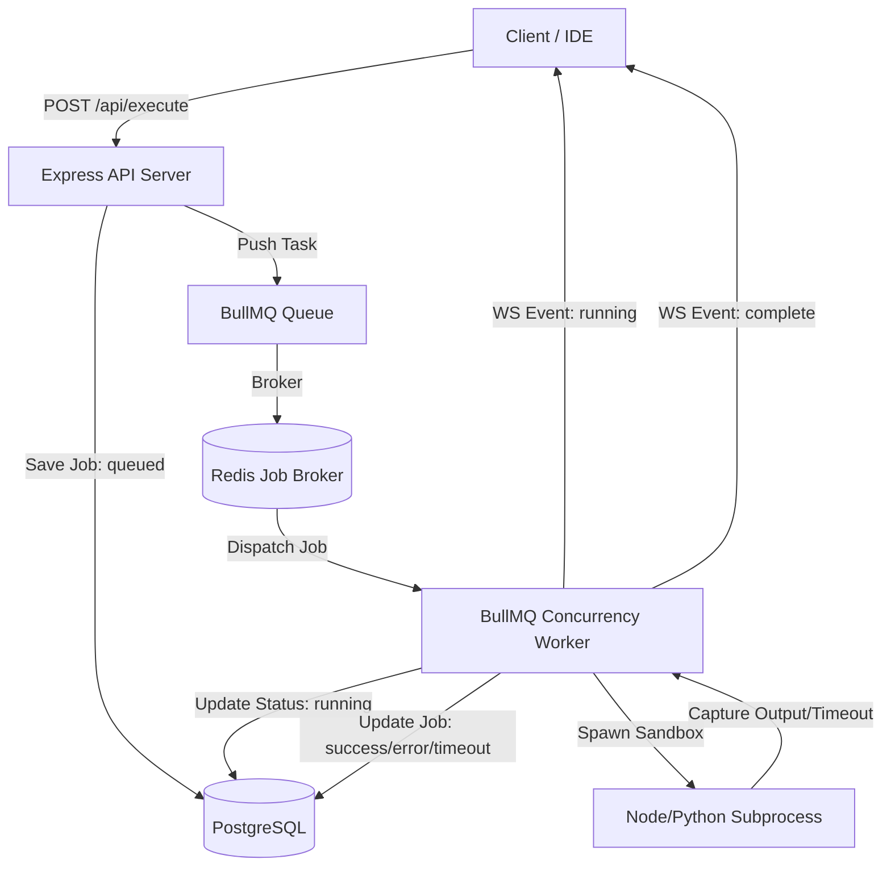

# Task 2 — Code Guru System Design

Code Guru is a distributed asynchronous code execution engine built using Node.js, TypeScript, BullMQ, Redis, PostgreSQL, and Socket.io.

## Highlights

### 1. Job Lifecycle Queuing (BullMQ + Redis)
- **Controlled Concurrency**: Solves high-concurrency CPU starvation issues by offloading executions into isolated background queues.
- **Fail Safe Recovery**: Relies on durable Redis lists backing worker queues, preserving executions even during app crashes.
- **Concurrent Workers**: Built to scale easily by launching additional background worker nodes.

### 2. Multi-Language Sandboxing
- **Isolated Runtimes**: Isolates execution scope using independent sub-processes (`child_process.spawn`) mapped to language CLI runtimes.
- **Safe Resource Tracking**: Enforces CPU limits using standard OS process timers. Kills process groups (`SIGKILL`) if they run past the 5-second timeout window.
- **Platform Agnostic Python Runner**: Dynamically resolves Unix runtimes (`python3`) to Windows standard commands (`python`) to ensure out-of-the-box local testing capabilities on any device.

### 3. State Synchronization (Socket.io WebSockets)
- **Dynamic Updates**: Connects user rooms (`user:<userId>`) to immediately push stage updates (`queued` -> `running` -> `success` / `error` / `timeout`).
- **Eliminates HTTP Polling**: Drastically reduces network resource overhead compared to standard REST interval polling loops.
