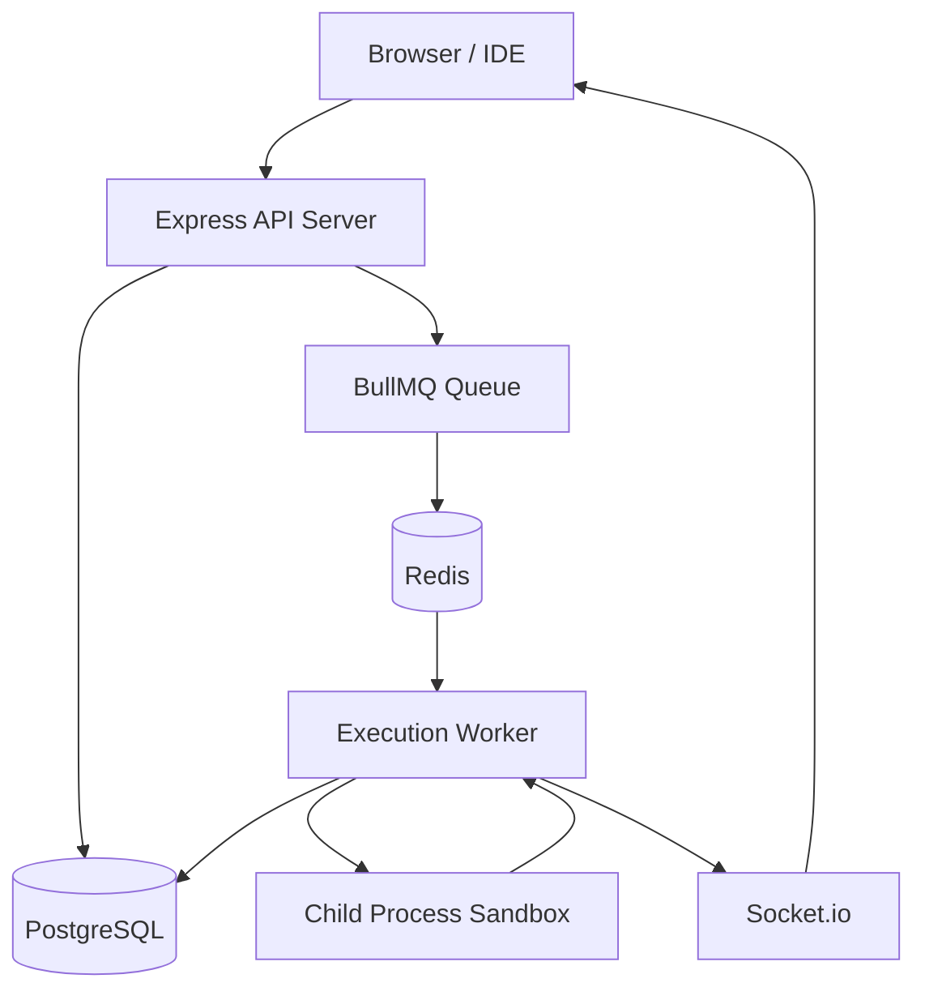
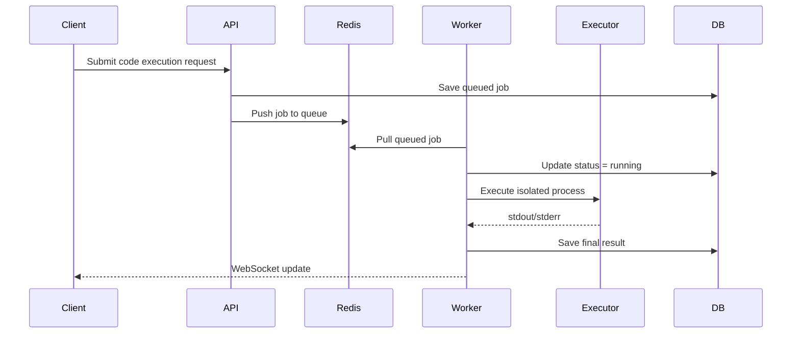

# Task 2 — Code Guru System Design

# Overview

Code Guru is a distributed asynchronous code execution engine designed for scalable and isolated execution of user-submitted code.

The system supports:

- concurrent execution
- multi-language runtimes
- realtime updates
- failure isolation
- execution timeout protection

---

# System Architecture



---

# 1. Execution Flow



---

# 2. Execution Strategy

# Code Isolation

Each execution runs in an isolated subprocess using:

- Node.js child_process
- Python subprocess

Benefits:

- process-level isolation
- execution independence
- crash containment

---

# Timeout Protection

Every execution receives:

```text
5-second timeout
```

Infinite loops are terminated automatically.

Example:

```javascript
while(true){}
```

gets forcefully killed.

---

# Multi-Language Support

Supported runtimes:

| Language | Runtime |
|---|---|
| JavaScript | Node.js |
| Python | Python Interpreter |

Execution adapters abstract runtime differences.

---

# Isolation Tradeoffs

| Method | Benefit | Drawback |
|---|---|---|
| Process Isolation | Lightweight | Less secure than containers |
| Docker Isolation | Strong security | Higher startup latency |

For this PoC:

```text
process isolation
```

was chosen for simplicity and speed.

---

# 3. Scalability Approach

# Queue-Based Architecture

BullMQ + Redis handle:

- concurrency control
- workload buffering
- worker distribution

---

# Horizontal Scaling

Additional workers can be added easily:

```text
Worker 1
Worker 2
Worker 3
```

All consume jobs from Redis concurrently.

---

# Traffic Spike Handling

Redis absorbs burst traffic safely.

Queued jobs wait until workers become available.

This prevents API crashes under load.

---

# 4. Failure Handling

# Failure Isolation

A failed execution:

- does not affect other jobs
- does not crash workers
- remains sandboxed

---

# Worker Crash Recovery

BullMQ automatically re-queues unfinished jobs if a worker crashes unexpectedly.

---

# Timeout Handling

Long-running executions are:

- forcefully terminated
- marked as timeout

---

# Retry Strategy

Currently:

```text
No automatic retries
```

to avoid repeated execution of potentially unsafe code.

---

# 5. State & Persistence

# Execution States

Jobs transition through:

```text
queued → running → success/error/timeout
```

---

# Persistence Strategy

| Layer | Purpose |
|---|---|
| Redis | Queue state |
| PostgreSQL | Durable execution history |

---

# User Disconnect Handling

If users disconnect:

- execution continues
- results remain persisted
- reconnecting clients can fetch history

---

# 6. Low-Bandwidth Optimization

## Lightweight Payloads

Only essential execution data is transmitted:

- status
- output
- execution time

---

# WebSocket Updates

Instead of polling:

- realtime socket updates reduce bandwidth usage
- clients receive only incremental state changes

---

# Log Streaming Strategy

Small outputs are buffered.

Large outputs may be streamed incrementally in production systems.

---

# 7. Operational Considerations

# Logging

The system logs:

- execution start
- execution end
- timeouts
- worker failures

---

# Monitoring

Metrics that should be monitored:

- queue size
- worker utilization
- execution latency
- failure rate

---

# Deployment Approach

The system supports:

- local Docker deployment
- cloud VM deployment
- Kubernetes worker scaling

---

# 8. Tradeoffs

| Decision | Benefit | Tradeoff |
|---|---|---|
| BullMQ queues | Scalable concurrency | Redis dependency |
| Process isolation | Fast startup | Weaker security |
| WebSockets | Realtime UX | Persistent connections |
| Persistent DB | Auditability | Additional storage cost |

---

# Final Notes

The architecture prioritizes:

- concurrency handling
- fault isolation
- realtime feedback
- scalable execution
- low operational complexity

while remaining developer-friendly and extensible.