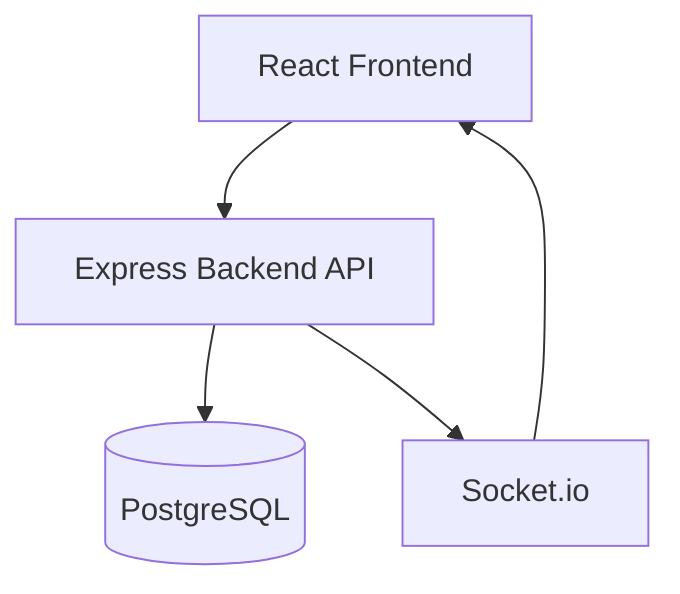
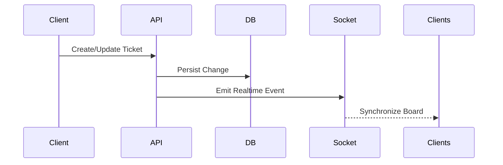
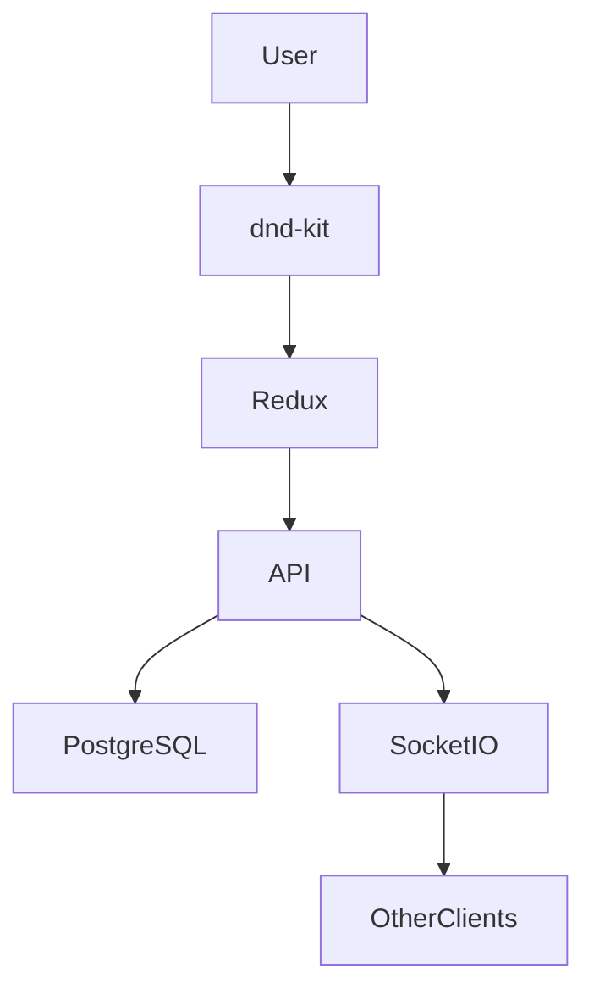

# Task 3 — Jira-Style Task Management System HLD

# Overview

This project is a lightweight collaborative Kanban-based task management platform inspired by Jira.

The system enables teams to:

- create tickets
- organize workflows
- manage subtasks
- collaborate in realtime
- synchronize updates instantly

---

# Phase 1 — Initial System Design

# High Level Architecture



---

# Frontend Architecture

The frontend uses:

- React
- TypeScript
- Redux Toolkit
- dnd-kit

---

# Frontend Modules

| Module | Responsibility |
|---|---|
| Board UI | Kanban rendering |
| Ticket Detail | Edit/view ticket |
| Redux Store | State management |
| Socket Layer | Realtime sync |
| Filters | Search/filter logic |

---

# Backend Architecture

The backend uses:

- Express.js
- PostgreSQL
- Socket.io

---

# Backend Responsibilities

| Component | Responsibility |
|---|---|
| REST API | CRUD operations |
| Socket.io | Live synchronization |
| Ticket Service | Business logic |
| PostgreSQL | Persistent storage |

---

# Database Schema Design

## tickets

| Column | Purpose |
|---|---|
| id | Primary key |
| title | Ticket title |
| description | Ticket details |
| status | Kanban stage |
| priority | Priority level |
| assignee_id | Assigned user |
| team_id | Team tag |
| parent_id | Parent ticket |
| position | Ordering |
| created_at | Timestamp |

---

# comments

| Column | Purpose |
|---|---|
| id | Comment ID |
| ticket_id | Linked ticket |
| message | Comment body |
| created_at | Timestamp |

---

# API Flow



---

# Drag-and-Drop Flow



---

# Realtime Synchronization

Socket.io events:

| Event | Purpose |
|---|---|
| ticket:created | New ticket |
| ticket:updated | Ticket edited |
| ticket:moved | Ticket reordered |
| ticket:deleted | Ticket removed |

---

# Parent-Child Ticketing

Tickets support hierarchy using:

```text
parent_id
```

Example:

```text
Authentication Module
    ├── Login API
    ├── Signup Flow
```

---

# Phase 2 — Scaling Discussion

# Expected Scale

Future assumptions:

- 100K+ tickets
- thousands of concurrent users
- multiple organizations
- realtime collaboration

---

# Database Scaling Strategies

# Indexing

Indexes should exist on:

- status
- assignee_id
- team_id
- parent_id
- position

---

# Pagination

Tickets should load incrementally:

```text
cursor pagination
```

instead of full-table fetches.

---

# Read Replicas

Read-heavy operations may use:

- PostgreSQL read replicas

to reduce primary DB load.

---

# Caching Strategy

Redis can cache:

- frequently accessed boards
- user sessions
- ticket filters
- comment counts

---

# Realtime Scaling

Socket.io scaling can use:

```text
Redis Pub/Sub Adapter
```

allowing multiple backend instances to synchronize websocket events.

---

# Queue/Event Systems

Heavy operations should move to queues:

Examples:

- notifications
- analytics
- activity logs
- email events

using:

- BullMQ
- Redis Streams

---

# API Performance Optimizations

## Optimizations

- selective field fetching
- pagination
- indexed queries
- lazy loading comments
- optimistic UI updates

---

# Rate Limiting

To prevent abuse:

- IP-based throttling
- JWT-based quotas
- websocket event throttling

can be applied.

---

# Horizontal Scaling

Backend APIs can scale horizontally:

```text
Load Balancer
    ↓
API Instance 1
API Instance 2
API Instance 3
```

Stateless APIs simplify scaling.

---

# Concurrency Handling

# Problem

Multiple users may edit tickets simultaneously.

---

# Solution

Strategies include:

- optimistic locking
- version numbers
- last-write timestamps

Realtime synchronization reduces stale state conflicts.

---

# Fault Tolerance

If websocket disconnects:

- client reconnects automatically
- latest board state refetches

Persistent storage prevents data loss.

---

# Tradeoffs

| Decision | Benefit | Tradeoff |
|---|---|---|
| Realtime sockets | Fast collaboration | More server memory |
| PostgreSQL persistence | Reliability | Scaling complexity |
| Optimistic UI | Smooth UX | Temporary inconsistencies |
| Drag-drop ordering | Better UX | Position management complexity |

---

# Security Considerations

Potential production improvements:

- JWT authentication
- RBAC permissions
- audit logs
- rate limiting
- websocket authorization

---

# Final Notes

The architecture prioritizes:

- realtime collaboration
- scalability
- maintainability
- responsive UI
- modular backend structure

while remaining simple enough for rapid feature iteration.